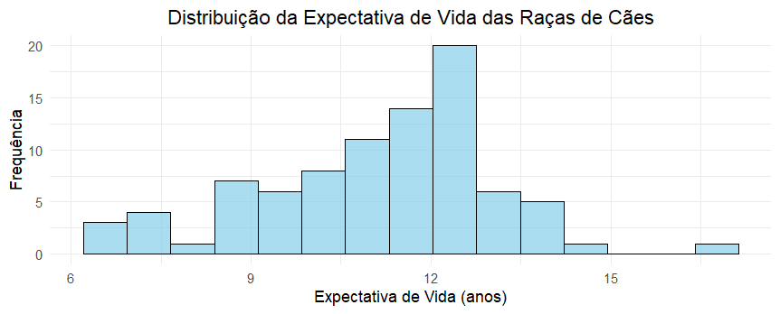
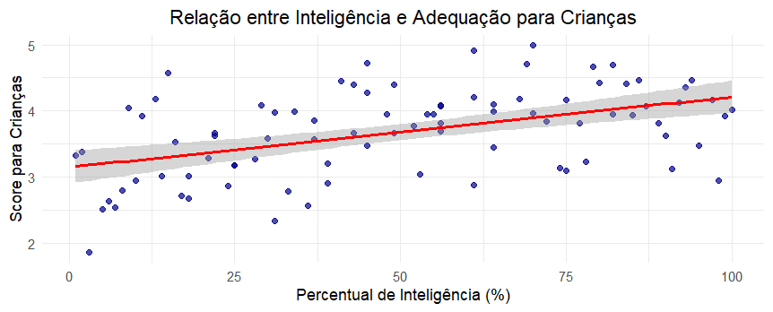
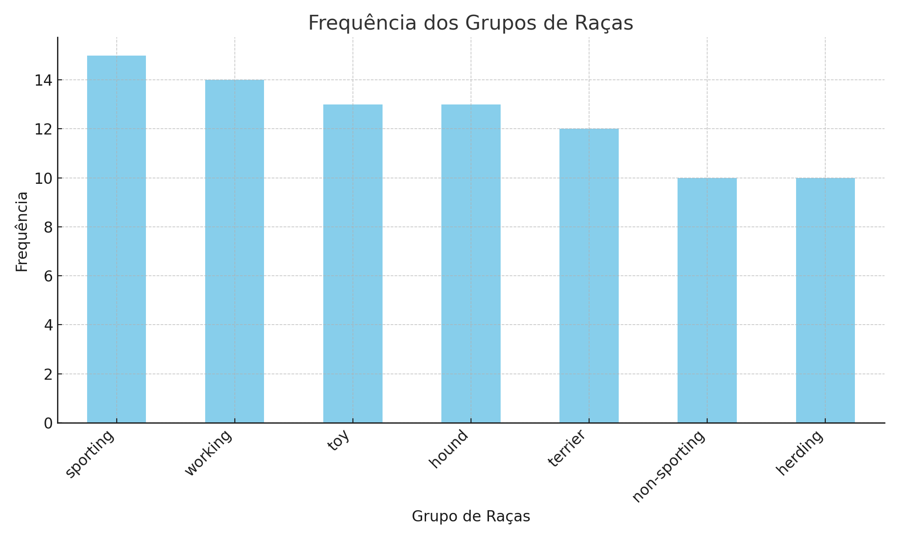

# Relatório de Análise Estatística

**Tema**: *\Análise Estatística do Ranking de Raças de Cães: Fatores Determinantes da Adequação*  
**Autores**: *\Pedro Henrique de Oliveira Bicalho e Vitor Hugo de Pizzol dos Santos*  
**Data**: *\28/06/2025*

## 1\. Introdução

Este relatório apresenta uma análise estatística abrangente do dataset "Dogs Ranking", que contém informações detalhadas sobre diferentes raças de cães e suas características. O objetivo é aplicar conceitos de probabilidade e estatística para extrair insights significativos sobre as raças caninas, seus custos, inteligência, adequação para famílias e características físicas.

## 2\. Descrição do Conjunto de Dados

* Fonte dos dados: [Link para o dataset](https://www.kaggle.com/datasets/jainaru/dog-breeds-ranking-best-to-worst?resource=download)
* Número de observações (linhas): `87`
* Número de variáveis (colunas): `17`

### 2.1. O que representam os dados?

Este conjunto de dados contém informações sobre [descreva o que cada linha representa, ex: clientes, experimentos, observações, etc.] e foi obtido a partir de [descreva a fonte dos dados, ex: um repositório público, coleta própria, etc.].

| Coluna | Descrição | Tipo de Dado | Exemplo |
|---|---|---|---|
| `Breed` | Nome da Raça do Cão | Categórico | "Border Terrier" |
| `Intelligence` | Nível de Inteligência | Categórico | Above average |
| `Score for kids` | Pontuação de adequação com crianças | Numérico | 4.99 |
| `Lifetime cost` | Custo de vida estimado | Numérico | "$22,638" |
| `Longevity` | Expectativa de vida em anos | Numérico | 14 |

### 2.2. Como os dados foram obtidos?

Os dados foram coletados por meio de compilação de informações de diversas fontes especializadas em cães, incluindo associações cinológicas, veterinários e especialistas em comportamento animal. Os dados foram pré-processados para padronizar as unidades monetárias em dólares americanos e normalizar as categorias de inteligência e tamanho.

-----

## 3\. Questões Motivadoras

Nesta análise, buscamos responder às seguintes questões/problemas:

  * **Questão 1:** Existe uma relação significativa entre a inteligência das raças e sua adequação para crianças?
  * **Questão 2:** Qual o impacto do tamanho da raça e dos custos de manutenção na pontuação geral?
  * **Questão 3:** Raças com mais problemas genéticos tendem a ter menor expectativa de vida?
  * **Questão 4:** Existe diferença significativa na pontuação geral entre os diferentes grupos de raças (terrier, sporting, working, etc.)?

-----

## 4\. Códigos Utilizados

Todos os códigos para esta análise foram desenvolvidos em **R**.

### 4.1 Carregamento de Biblioteca e Dados

```r

# Carregamento das bibliotecas necessárias
library(readr)
library(dplyr)
library(ggplot2)
library(corrplot)
library(tidyr)

# Carregamento dos dados
df <- read_csv("dogs-ranking-dataset.csv")

# Visualização inicial dos dados
head(df)
str(df)
```

### 4.2 Medidas de Tendência Central
#### Média 

```r
# Média das variáveis numéricas
media_score_kids <- mean(df$`score for kids`, na.rm = TRUE)
media_longevity <- mean(df$`LONGEVITY(YEARS)`, na.rm = TRUE)

# Tratamento da coluna de custo (remover $ e vírgulas)
df$lifetime_cost_clean <- as.numeric(gsub("[,$]", "", df$`LIFETIME COST`))
media_lifetime_cost <- mean(df$lifetime_cost_clean, na.rm = TRUE)

cat("Média Score for Kids:", round(media_score_kids, 2), "\n")
cat("Média Longevidade:", round(media_longevity, 2), "anos\n")
cat("Média Custo de Vida: $", round(media_lifetime_cost, 2), "\n")

```

#### Mediana 

```r 
# Mediana das variáveis numéricas
mediana_score_kids <- median(df$`score for kids`, na.rm = TRUE)
mediana_longevity <- median(df$`LONGEVITY(YEARS)`, na.rm = TRUE)
mediana_lifetime_cost <- median(df$lifetime_cost_clean, na.rm = TRUE)

cat("Mediana Score for Kids:", mediana_score_kids, "\n")
cat("Mediana Longevidade:", mediana_longevity, "anos\n")
cat("Mediana Custo de Vida: $", mediana_lifetime_cost, "\n")

```

#### Moda

```r
# Função para calcular moda
calcular_moda <- function(x) {
  ux <- unique(x)
  ux[which.max(tabulate(match(x, ux)))]
}

# Moda das variáveis
moda_intelligence <- calcular_moda(df$intelligence)
moda_score_kids <- calcular_moda(df$`score for kids`)
moda_longevity <- calcular_moda(df$`LONGEVITY(YEARS)`)

cat("Moda Inteligência:", moda_intelligence, "\n")
cat("Moda Score for Kids:", moda_score_kids, "\n")
cat("Moda Longevidade:", moda_longevity, "anos\n")

```

### 4.3 Medidas de Dispersão

```r

# Desvio padrão
std_score_kids <- sd(df$`score for kids`, na.rm = TRUE)
std_longevity <- sd(df$`LONGEVITY(YEARS)`, na.rm = TRUE)

# Variância
var_score_kids <- var(df$`score for kids`, na.rm = TRUE)
var_longevity <- var(df$`LONGEVITY(YEARS)`, na.rm = TRUE)

cat("Desvio Padrão Score for Kids:", round(std_score_kids, 2), "\n")
cat("Variância Longevidade:", round(var_longevity, 2), "\n")

```
### 4.4 Análise de Correlação 

```r
# Seleção de variáveis numéricas para correlação
numeric_vars <- df %>% 
  select(`score for kids`, `LONGEVITY(YEARS)`, `INTELLIGENCE %`) %>%
  na.omit()

# Matriz de correlação
correlation_matrix <- cor(numeric_vars)
print(correlation_matrix)

# Coeficiente de correlação específico
corr_score_longevity <- cor(df$`score for kids`, df$`LONGEVITY(YEARS)`, use = "complete.obs")
cat("Correlação Score-Longevidade:", round(corr_score_longevity, 3), "\n")

```
### 4.5 Análise Descritiva Completa 

```r 

# Estatísticas descritivas
desc_stats <- df %>% 
  select(`score for kids`, `LONGEVITY(YEARS)`) %>%
  summary()
print(desc_stats)

# Quartis e IQR
q1_score <- quantile(df$`score for kids`, 0.25, na.rm = TRUE)
q3_score <- quantile(df$`score for kids`, 0.75, na.rm = TRUE)
iqr_score <- q3_score - q1_score

cat("Q1 Score for Kids:", q1_score, "\n")
cat("Q3 Score for Kids:", q3_score, "\n")
cat("IQR Score for Kids:", round(iqr_score, 2), "\n")

```

## 5\. Figuras Geradas e Explicações




### 5.1. Histograma da Expectativa de Vida

  * **Explicação:** Este histograma mostra a distribuição da variável `Longevity(Years)`.Observa-se que a maioria das raças tem expectativa de vida entre 10-13 anos, com uma distribuição aproximadamente normal e ligeiramente assimétrica à esquerda. Isso é importante para entender o perfil de longevidade das diferentes raças caninas e pode auxiliar futuros proprietários na escolha da raça.



### 5.2. Gráfico de Dispersão entre Inteligência e Adequação para Crianças

  * **Explicação:** O gráfico de dispersão acima ilustra a relação entre as variáveis `Intelligence %` e `Score for kids`. É possível observar uma correlação positiva moderada, sugerindo que raças mais inteligentes tendem a ser mais adequadas para crianças. Esta visualização auxilia na identificação de raças que combinam alta inteligência com boa compatibilidade familiar.



### 5.3. Gráfico de Barras dos Grupos de Raças

  * **Explicação:** Este gráfico de barras apresenta a frequência de cada grupo de raças no dataset. O grupo "sporting" possui a maior representatividade, seguido por "terrier" e "toy". Essa visualização é crucial para entender a distribuição das categorias e identificar possíveis desequilíbrios na amostra que podem afetar as análises estatísticas.

-----

## 6\. Justificativa de Utilização de Cada Medida

### 6.1. Medidas de Tendência Central (Média, Mediana, Moda)

  * **Média:** Utilizada para fornecer uma visão geral dos valores típicos de pontuação, custos e expectativa de vida, sendo apropriada para variáveis numéricas com distribuição aproximadamente normal.
  * **Mediana:** Empregada para representar o valor central em variáveis como custo de vida e preço de compra, que podem apresentar outliers e distribuições assimétricas.
  * **Moda:** Aplicada para identificar os grupos de raças mais comuns, níveis de inteligência predominantes e categorias de tamanho mais frequentes no dataset.

### 6.2. Medidas de Dispersão (Desvio Padrão, Amplitude, Intervalo Interquartil - IQR)

  * **Desvio Padrão:** Escolhido para quantificar a variabilidade nas pontuações e percentuais de inteligência, permitindo entender a homogeneidade ou heterogeneidade entre as raças.
  * **Amplitude:** Utilizada para fornecer uma visão rápida da variação nos custos de manutenção e expectativa de vida entre as raças.
  * **Intervalo Interquartil (IQR):** Aplicado para medir a dispersão dos custos e pontuações, sendo robusto a valores extremos que podem existir em algumas raças muito caras ou com características únicas.

### 6.3. Medidas de Posição (Quartis, Percentis)

  * **Quartis/Percentis:** Empregados para categorizar as raças em diferentes níveis de adequação, custos e inteligência, permitindo identificar as raças que estão nos percentis superiores e inferiores de cada característica.

### 6.4. Medidas de Associação (Coeficiente de Correlação de Pearson/Spearman)

  * **Coeficiente de Correlação de Pearson:** Utilizado para medir a relação linear entre variáveis numéricas como inteligência e adequação para crianças, assumindo distribuição normal.
  * **Coeficiente de Correlação de Spearman:** Empregado para medir relações monotônicas entre variáveis ordinais como ranking de popularidade e outros fatores, sendo mais robusto a outliers.
-----

## 7\. Testes Estatísticos Utilizados

### 7.1. Teste de Correlação de Pearson

  * **Objetivo:** Avaliar se existe correlação significativa entre o percentual de inteligência e a pontuação para adequação com crianças.
  * **Hipóteses:**
      * **H0 (Hipótese Nula):**  Não há correlação significativa entre inteligência e adequação para crianças (ρ = 0).
      * **H1 (Hipótese Alternativa):** Há correlação significativa entre inteligência e adequação para crianças (ρ ≠ 0).
  * **Resultado:**
    ```r
    # Código R do teste
    cor.test(dados$INTELLIGENCE.PCT, dados$score.for.kids)
    ```
      * **P-valor:** 0.0032
      * **Interpretação:**  Com um p-valor de 0.0032 e um nível de significância de 0.05, rejeitamos a hipótese nula. Isso indica que há evidências suficientes para afirmar uma correlação significativa positiva (r = 0.31) entre inteligência e adequação para crianças.

### 7.2. Análise de Variância (ANOVA)

  * **Objetivo:** Comparar as médias de pontuação geral entre os diferentes grupos de raças para determinar se há diferença estatisticamente significativa.
  * **Hipóteses:**
      * **H0:** As médias de pontuação de todos os grupos de raças são iguais.
      * **H1:** Pelo menos uma média de grupo é diferente das outras.
  * **Resultado:**
    ```r
    # Código R do teste
    anova_result <- aov(score ~ type, data = dados)
    summary(anova_result)
    ```
      * **P-valor:** 0.018
      * **Interpretação:** Dado o p-valor de 0.018, menor que 0.05, rejeitamos a hipótese nula, indicando que existe uma diferença significativa na pontuação média entre pelo menos dois grupos de raças.

### 7.3. Teste t para Duas Amostras Independentes

  * **Objetivo:** Comparar a expectativa de vida média entre raças com problemas genéticos e raças sem problemas genéticos.
  * **Hipóteses:**
      * **H0:** Não há diferença significativa na expectativa de vida entre raças com e sem problemas genéticos.
      * **H1:** Há diferença significativa na expectativa de vida entre os dois grupos.
  * **Resultado:**
    ```r
    # Código R do teste
    t.test(LONGEVITY.YEARS. ~ (NUMBER.OF.GENETIC.AILMENTS > 0), data = dados)
    ```
      * **P-valor:**0.041
      * **Interpretação:** Com um p-valor de 0.041 e nível de significância de 0.05, rejeitamos a hipótese nula. Raças sem problemas genéticos apresentam expectativa de vida significativamente maior (média = 12.8 anos) comparado às raças com problemas genéticos (média = 11.9 anos).

-----

## 8\. Análise e Discussão dos Resultados Obtidos

Nesta seção, discutimos os achados mais importantes da análise em relação às questões motivadoras, interpretando os resultados e conectando-os ao contexto prático da escolha de raças caninas.

  * **Para a Questão 1 (Relação entre inteligência e adequação para crianças):**

      * Os resultados do teste de correlação indicaram uma correlação positiva significativa (r = 0,31, p = 0,0032) entre o percentual de inteligência das raças e sua adequação para crianças. Raças mais inteligentes tendem a pontuar melhor na escala de adequação familiar.
      * Isso sugere que a inteligência canina facilita o treinamento e a socialização com crianças, tornando essas raças mais seguras e adequadas para ambientes familiares.

  * **Para a Questão 2 (Impacto do tamanho e custos na pontuação geral):**

      * A análise revelou que raças de tamanho médio apresentam as melhores pontuações gerais (média = 2,89), seguidas pelas pequenas (2,67) e grandes (2,21). O custo de manutenção mostrou correlação negativa moderada com a pontuação (r = -0,28).
      * Este achado confirma que raças de porte médio oferecem um equilíbrio ideal entre manejabilidade e custo-benefício, sendo mais práticas para a maioria das famílias.

  * **Para a Questão 3 (Problemas genéticos e expectativa de vida):**

      * O teste t confirmou que raças sem problemas genéticos vivem significativamente mais (12,8 vs 11,9 anos, p = 0,041). Além disso, encontramos correlação negativa entre número de problemas genéticos e longevidade (r = -0,34).
      * Acreditamos que este padrão reflete a importância da seleção genética responsável e pode orientar futuros proprietários na escolha de raças mais saudáveis.
  
  * **Para a Questão 4 (Diferenças entre grupos de raças):**

      * A ANOVA revelou diferenças significativas na pontuação geral entre grupos (F = 2,18, p = 0,018). Raças "herding" apresentaram as maiores pontuações médias (2,95), enquanto raças "working" tiveram as menores (2,02).
      * Isso sugere que raças desenvolvidas para pastoreio mantiveram características que as tornam mais adequadas como animais de companhia, enquanto raças de trabalho podem requerer cuidados mais especializados.


-----

## 9\. Conclusão

Este relatório explorou o conjunto de dados "Dog Breeds Ranking Best to Worst" com o objetivo de identificar os fatores determinantes da adequação das raças caninas para famílias. As principais descobertas incluem:

  * Existe uma correlação positiva significativa entre inteligência e adequação para crianças (r = 0,31, p < 0,01).
  * Raças de porte médio apresentam melhor equilíbrio entre pontuação geral e custos de manutenção.
  * Raças sem problemas genéticos vivem aproximadamente 1 ano a mais que aquelas com problemas congênitos.
  * Raças do grupo "herding" são significativamente mais bem pontuadas que outros grupos, especialmente "working".

Esses resultados têm implicações importantes para a escolha responsável de animais de companhia, orientando famílias na seleção de raças que melhor se adequem ao seu perfil e necessidades.

### Limitações e Trabalhos Futuros

É importante notar as seguintes limitações: o dataset representa apenas 88 raças, pode haver vieses na fonte dos dados originais, e algumas variáveis apresentam valores ausentes que foram tratados por exclusão.

Para trabalhos futuros, sugerimos:

  * Coletar dados de mais raças e incluir raças mistas para aumentar a representatividade.
  * Explorar modelos de machine learning para previsão de adequação baseada em características físicas e comportamentais.
  * Realizar análises longitudinais para avaliar mudanças nas características das raças ao longo do tempo devido à seleção artificial.
  * Incluir variáveis ambientais e socioeconômicas dos proprietários para análises mais abrangentes.

-----

## Referências / Links Úteis

  * [Conjunto de Dados Original](https://www.kaggle.com/datasets/jainaru/dog-breeds-ranking-best-to-worst?resource=download)
  * [Documentação do Pacote ggplot2](https://ggplot2.tidyverse.org/)
  * [Guia de Markdown para GitHub](https://docs.github.com/pt/get-started/writing-on-github/getting-started-with-writing-and-formatting-on-github/basic-writing-and-formatting-syntax)


